# Jeedom TV

[](https://github.com/replicatorbe/JeedomTvGoogleBE/actions/workflows/android.yml)

Application Android TV (Google TV) pour afficher et piloter à la télécommande des tuiles domotiques servies par le plugin Jeedom `jeetvbe`, sur le réseau local.

Le contrat entre l'application et le plugin est décrit dans [docs/api.md](docs/api.md). Il fait foi pour les deux côtés.

## En images

Captures en 1920×1080, avec une maison de démonstration (noms et valeurs fictifs).

**Les pages, à la télécommande** : onglets avec l'icône de la page, infos de la maison, tuiles en cartes (allumées en ambre), barre d'état en haut à droite.

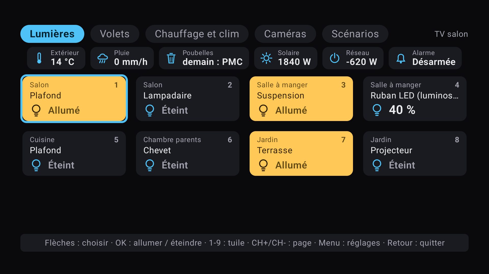

| Volets (jauge de position) | Chauffage et clim |
|---|---|
| 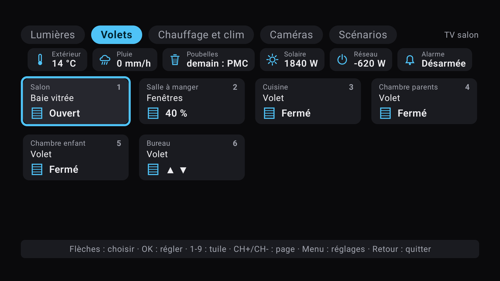 | 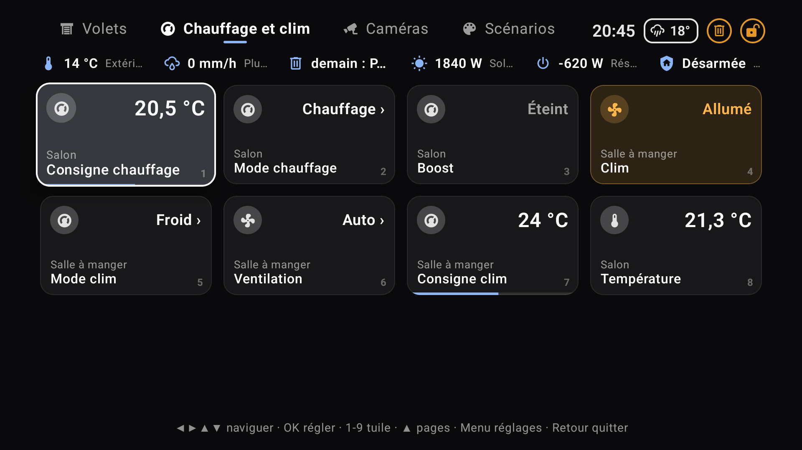 |
| **Liste de choix** (mode de la clim) | **Caméras** (ouvertes en direct avec CameraOnTv) |
| 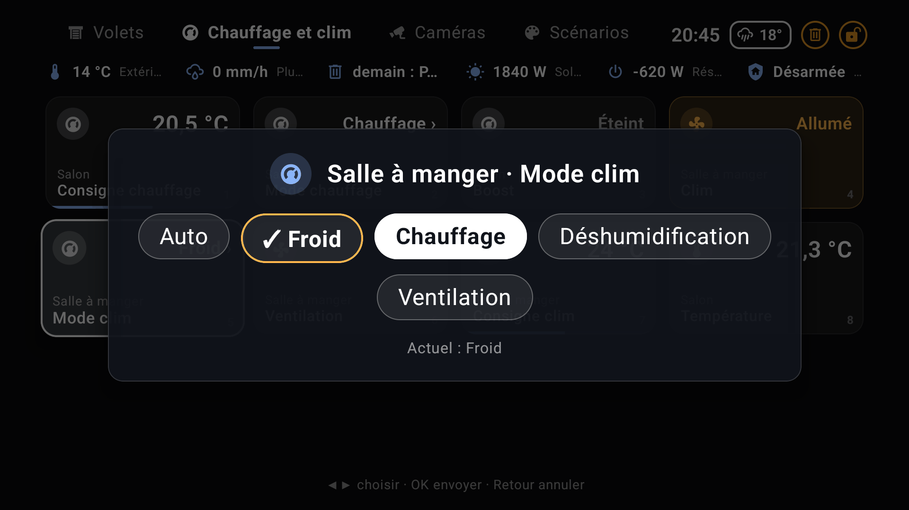 | 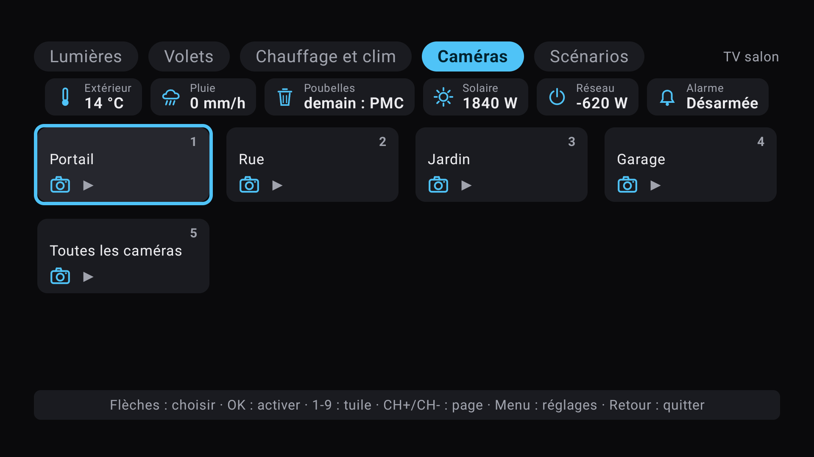 |
| **Scénarios** (Cinéma, Bonne nuit, Je pars) | **Écran de veille domotique** |
| 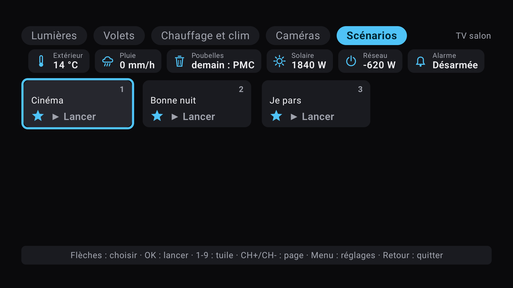 | 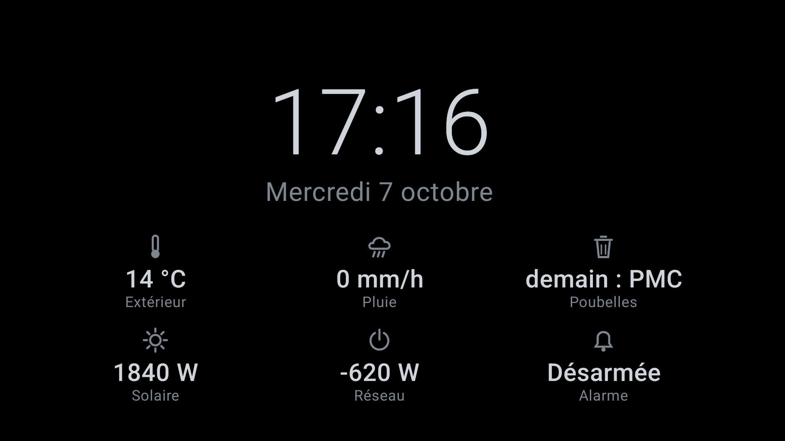 |

**Par-dessus la télé, sans l'interrompre** : une touche de couleur ou un ordre de Jeedom ouvre le panneau ; la barre d'état reste dans son coin (ici en haut à gauche).

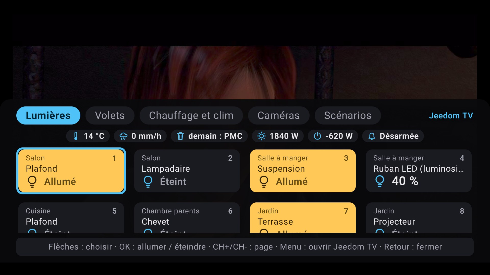

**Barre d'état** (remplace TvOverlay) : l'heure et les indicateurs de Jeedom, en permanence dans un coin de l'écran.


| On sonne : la caméra en direct et la question | Question de 23 h, en bas de l'écran |
|---|---|
| 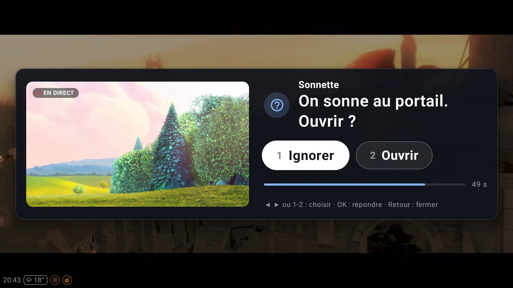 | 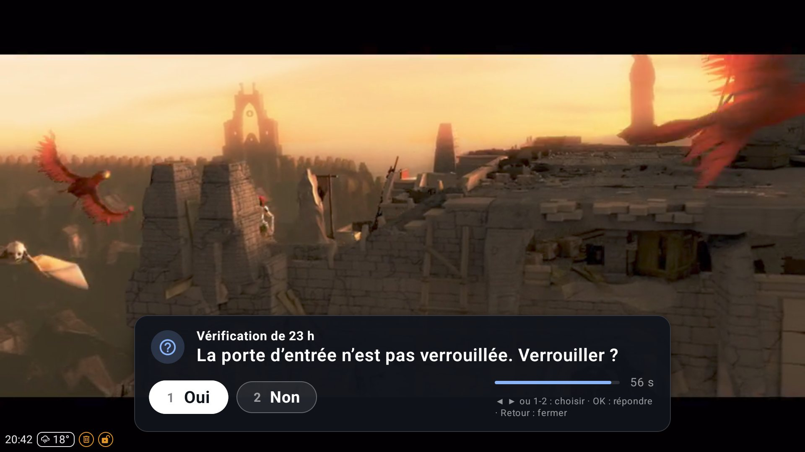 |
| **Notification** : portail ouvert | **Vidéo en direct** de la caméra, badge EN DIRECT |
| 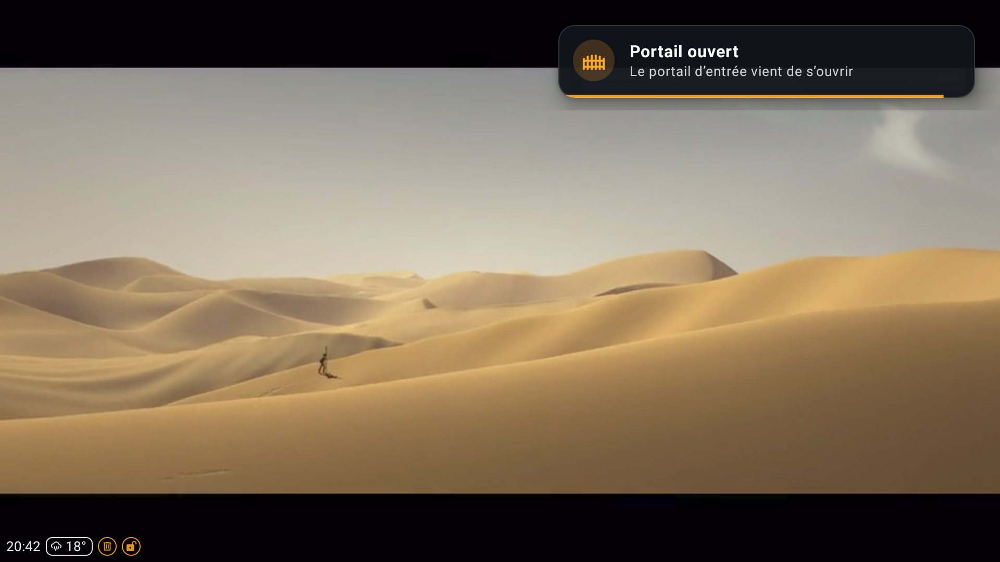 | 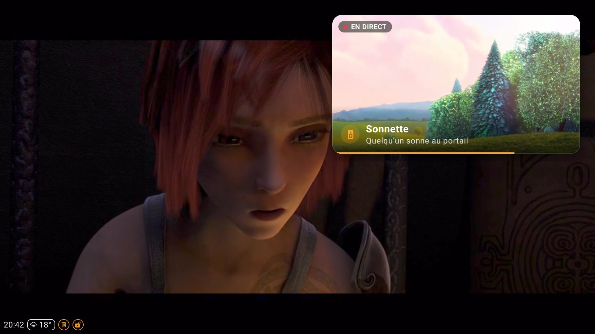 |
| **Notification avec photo** | |
| 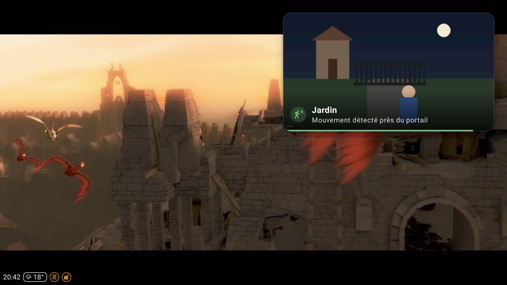 | |

<sub>Vidéo d'arrière-plan : *Sintel*, © Blender Foundation, [durian.blender.org](https://durian.blender.org), licence Creative Commons Attribution 3.0. Vidéo « en direct » : flux public de test (*Big Buck Bunny*, © Blender Foundation, [peach.blender.org](https://peach.blender.org), licence Creative Commons Attribution 3.0). Photo du portier : illustration dessinée pour la démonstration. Icônes : Material Design Icons (voir [Licences](#licences-des-composants-tiers)).</sub>

## Fonctionnalités

- Pages de tuiles définies dans Jeedom, une rangée d'onglets en haut, une grille de 4 colonnes en dessous.
- Types de tuiles :
  - **interrupteur** : allumer / éteindre ; allumé, la tuile prend l'accent ambre (pastille, état, fond légèrement teinté) ;
  - **volet** : réglage de la position, ou monter / descendre / stop pour un volet sans retour de position ;
  - **curseur** : réglage d'une consigne entre un minimum et un maximum ;
  - **info** : affichage d'une valeur avec son unité ;
  - **scénario** : lancement, avec un bref retour visuel ;
  - **liste de choix** : mode d'une clim, source de chauffe… La tuile affiche le choix en cours ; OK ouvre la liste ;
  - **bouton** : exécute une commande action choisie dans le plugin (par exemple « Afficher caméra » de CameraOnTv), avec un bref retour visuel. Il affiche « ▶ », ou la valeur de son état s'il en a un. Icône caméra disponible.
- Valeurs en direct : l'application attend les changements de Jeedom (attente longue), affichée ou non (service au premier plan).
  - La grille se recharge seule quand les pages changent dans Jeedom ; la sélection suit sa tuile.
  - Un indicateur « hors ligne » discret s'affiche quand Jeedom ne répond plus, sur l'écran des pages comme sur le panneau. L'application réessaie après 3 s, puis de plus en plus espacé (30 s au plus) tant que Jeedom reste injoignable ; au rallumage de l'écran ou au retour du réseau, aussitôt.
- Confirmation avant tout ordre sur une tuile marquée « confirmer » dans Jeedom.
- La TV ne connaît aucun id de commande Jeedom : une clé volée ne pilote que les tuiles de cette TV.
- Pilotage par Jeedom, même pendant un film (service au premier plan, démarré avec la TV) :
  - **Afficher une page** : pendant un film, en [superposition](#superposition-par-dessus-la-vidéo), sans interrompre la vidéo ; sinon dans l'application, avec retour automatique après une durée. Une touche de la télécommande annule le retour ;
  - **Message** : bandeau d'environ 8 s, dans l'application ou par-dessus la vidéo ; `[durée=<s>]` dans le message en fixe la durée (3 à 120 s) ;
  - **Quitter** : la superposition se ferme, ou l'application passe en arrière-plan.
  - **Question** (bloc « Demander » d'un scénario) : on répond à la télécommande, le scénario continue selon la réponse. Voir [Questions de Jeedom](#questions-de-jeedom).
- Jeedom connaît l'état de la TV : application visible, écran allumé, page affichée, et version de l'application (info `Version app`).
- **Bandeau d'infos** : jusqu'à 6 infos de la maison (température extérieure, poubelles, production solaire…) choisies dans Jeedom, sous les onglets et dans le panneau en superposition. Voir [Bandeau d'infos](#bandeau-dinfos).
- **Écran de veille domotique** : grande horloge, date, et les infos du bandeau en grand, à la place de l'écran ambiant Google TV. Voir [Écran de veille](#écran-de-veille-domotique).
- **Touches de couleur** : rouge, vert, jaune et bleu ouvrent chacune une page choisie dans Jeedom, même par-dessus la télé. Voir [Touches de couleur](#touches-de-couleur).
- **Tableau des trains** : page plein écran façon tableau de gare SNCB (retards, suppressions, voies, perturbations), remplie par le plugin à partir du plugin SNCB/NMBS et mise à jour en direct ; page cachée, ouverte par `Afficher Trains` (même par-dessus la télé), Retour la ferme.
- **Remplace TvOverlay** : **barre d'état** (heure et indicateurs en permanence dans un coin), **notifications riches** (icône, coin, image) et **vidéo en direct** de la caméra dans une incrustation. Voir [Barre d'état et notifications](#barre-détat-et-notifications-remplace-tvoverlay).
- Icônes **Material Design Icons** embarquées (licence Apache 2.0, voir [Licences](#licences-des-composants-tiers)).
- La version (« Jeedom TV 0.9.5 ») s'affiche discrètement sur l'écran de configuration.

| Touche | Grille | Onglets | Mode réglage (curseur, volet avec position) | Volet sans position |
|---|---|---|---|---|
| Flèches | Déplacer la sélection ; ▲ sur la première rangée : monter dans les onglets | ◀ ▶ : page précédente / suivante, affichée aussitôt (en boucle) · ▼ : première tuile | ▲ ▼ : ± un pas · ◀ ▶ : min / max | ▲ monter · ▼ descendre |
| OK | Agir sur la tuile (voir ci-dessous) | Première tuile | Envoyer la valeur et sortir | Stop |
| 1 à 9 | Agir sur la tuile N de la page | Comme dans la grille : redescendre sur la tuile N et agir | – | – |
| CH+ / CH- | Page suivante / précédente (en boucle) | Idem, retour aux tuiles | Volet : monter / descendre | Monter / descendre |
| Rouge, vert, jaune, bleu | Page associée | Page associée, retour aux tuiles | Page associée (le réglage est abandonné) | Page associée |
| Menu | Configuration | Configuration | Configuration | Configuration |
| Retour | Quitter | Retour aux tuiles | Annuler | Sortir |

Les onglets se pilotent aux flèches pour les télécommandes sans CH+ / CH- (comme celle des TV TCL Google TV) : l'onglet ciblé est cerclé, et aucune tuile n'est alors mise en avant. Sur une page sans tuile, le focus reste dans les onglets (▼ et OK n'ont rien à rejoindre) et Retour quitte, comme depuis la grille.

OK selon la tuile :

| Tuile | Effet |
|---|---|
| Interrupteur | Bascule. L'affichage change tout de suite, puis Jeedom le corrige si besoin. En cas d'erreur, l'ancienne valeur revient et un message s'affiche 4 s. Une réponse de Jeedom arrivée en retard n'écrase jamais une valeur plus récente (second appui, changement reçu entre-temps). |
| Scénario | Lance le scénario. |
| Bouton | Exécute sa commande Jeedom. |
| Liste de choix | Ouvre le mode de choix : les libellés, la valeur actuelle marquée d'un ✓. ◀ ▶ (ou ▲ ▼) parcourent, OK envoie le choix (affiché tout de suite, puis corrigé par Jeedom si besoin), Retour annule. Fonctionne aussi dans le panneau en superposition. |
| Curseur, volet | Entre en mode réglage. La valeur en attente part de la valeur actuelle. |
| Info | Rien. |

Boîte de confirmation : OK confirme, Retour annule.

Tuiles en cartes (pastille d'icône, valeur ou état en haut, pièce et nom dessous, fine jauge pour un volet ou un curseur, liste de choix avec son choix courant et un chevron) ; la tuile sélectionnée grossit légèrement, s'éclaircit et prend un liseré blanc. Onglets en texte avec l'icône de la page, l'actif souligné. Une ligne courte en bas de l'écran rappelle les touches du contexte.

## Architecture (MVC)

```
app/src/main/java/be/jeedomtv/
├── JeedomTvApp   Racine de composition : Modèle et Contrôleur vivent aussi longtemps que le processus
├── view/OverlayWindowManager   Fenêtres de superposition (bandeau, panneau, question) hors de toute activité
├── JeedomTvService / BootReceiver   Service au premier plan (boucle des changements permanente), démarré avec la TV
├── ColorKeyService   Service d'accessibilité : touches de couleur captées par-dessus les autres applications
├── view/HomeDreamService   Écran de veille (DreamService) : horloge et infos du bandeau
├── view/StatusBarView, LiveVideo, MdiIcon   Barre d'état, vidéo en direct (Media3), icônes Material Design
├── model/        État de l'application (AppModel, AppState), configuration, pages et tuiles
│   └── driver/   Interface JeedomDriver + implémentation HTTP (OkHttp, kotlinx.serialization)
├── controller/   AppController (écrans, sélection, réglage, confirmation, changements en direct)
│                 ordres de Jeedom, état signalé, RemoteKeyMapper (touches → commandes)
│                 et ColorKeyFilter (touches gardées par le service d'accessibilité)
└── view/         Écrans Compose for TV : configuration, chargement, pages, tuile, confirmation
```

- Le **contrôleur** reçoit les commandes de la télécommande et met à jour le **modèle**. Il ne touche jamais à Android.
- La **vue** observe le modèle et se redessine. La sélection (page, tuile) est portée par l'état, pas par le focus Compose.
- Jeedom est accessible via l'interface `JeedomDriver`. Les tests du contrôleur utilisent un pilote factice.

Stack : Kotlin, Jetpack Compose for TV, OkHttp, kotlinx.serialization, DataStore.

## Compiler et installer

Prérequis : Android SDK (API 35) et JDK 17 ou plus.

```bash
./gradlew :app:testDebugUnitTest      # tests unitaires
./gradlew :app:assembleDebug          # APK : app/build/outputs/apk/debug/app-debug.apk
./gradlew :app:assembleRelease        # APK : app/build/outputs/apk/release/app-release.apk
```

Le build **release** est réduit et optimisé par R8 : il démarre beaucoup plus vite que le build debug sur la TV. Il est signé avec la clé de debug Android : il s'installe par adb sans keystore, et par-dessus un build debug du même poste (la configuration est conservée).

Installation sur la TV :

1. Activer les options développeur sur la TV, puis le débogage réseau.
2. Installer et lancer l'app :

```bash
adb connect <IP_TV>:5555
adb install -r app/build/outputs/apk/release/app-release.apk
```

Ensuite, appliquer les réglages de la section [Optimiser la TV](#optimiser-la-tv-adb-sans-root) : au minimum les deux premiers, sans lesquels le pilotage en arrière-plan ne fonctionne pas.

Au premier lancement, l'écran de configuration demande :

- l'adresse de Jeedom (par exemple `192.168.1.10` ; un port est accepté : `jeedom.local:8080`) ;
- la clé de la TV, affichée sur la page de l'équipement Jeedom TV correspondant dans le plugin.

La configuration n'est enregistrée qu'après une connexion réussie. Elle reste sur la TV : l'application est exclue de la sauvegarde du compte Google (la clé n'en sort pas).

Une clé déjà enregistrée s'affiche masquée (`••••••••3f2a`, les 4 derniers caractères). Laissée telle quelle, elle est conservée à la validation ; dès qu'on tape ou efface un caractère, le champ repart vide et en clair pour saisir la nouvelle clé.

En build debug uniquement, la configuration peut aussi être passée par adb, ce qui évite la saisie au clavier de la TV :

```bash
adb shell am start -n be.jeedomtv/.view.MainActivity \
  --es jeedom_host <IP_JEEDOM> --es jeedom_key '<CLE_DE_LA_TV>'
```

## Optimiser la TV (adb, sans root)

Réglages utiles sur une TCL Google TV (Android 11). Ils sont réversibles et survivent à un redémarrage. À lancer depuis une machine du réseau, après `adb connect <IP_TV>:5555`.

### Indispensables au pilotage en arrière-plan

```bash
# Superposition par-dessus la vidéo, et ouverture de l'écran depuis l'arrière-plan
adb shell appops set be.jeedomtv SYSTEM_ALERT_WINDOW allow

# TCL : autoriser le démarrage automatique (refusé par défaut, il bloque le service au démarrage)
adb shell appops set be.jeedomtv APP_AUTO_START allow
```

### Recommandés

```bash
# Exempter l'application de l'économiseur d'énergie et des restrictions d'arrière-plan
adb shell dumpsys deviceidle whitelist +be.jeedomtv
adb shell appops set be.jeedomtv RUN_IN_BACKGROUND allow
adb shell appops set be.jeedomtv RUN_ANY_IN_BACKGROUND allow
```

Vérification :

```bash
adb shell appops get be.jeedomtv
adb shell dumpsys deviceidle whitelist | grep jeedomtv
```

### Libérer de la mémoire (optionnel)

```bash
# Économiseur d'écran / mode ambiant Google TV (~200 Mo)
adb shell settings put secure screensaver_enabled 0          # réactiver : 1

# Applications TCL inutilisées (désactivées, pas désinstallées)
adb shell pm disable-user --user 0 com.tcl.usercenter        # compte TCL
adb shell pm disable-user --user 0 com.tcl.miracast          # Miracast (Chromecast reste disponible)
adb shell pm disable-user --user 0 com.tcl.esticker
adb shell pm disable-user --user 0 tv.wuaki.apptv            # Rakuten TV
# réactiver : adb shell pm enable <paquet>
```

### Interface plus réactive (optionnel)

```bash
adb shell settings put global window_animation_scale 0.5
adb shell settings put global transition_animation_scale 0.5
adb shell settings put global animator_duration_scale 0.5
# valeur d'origine : 1
```

### Bon à savoir

- **TCL a son propre gestionnaire de mémoire** (`com.tcl.guard`). Il ne peut pas être désactivé sans root, mais il épargne les applications qui ont un service au premier plan, comme celle-ci.
- **Veille et réseau** : au rallumage de l'écran et au retour du réseau, l'application relance aussitôt l'attente des changements, avec des pages rechargées, et signale son état à Jeedom.
- **Ordres périmés** : un ordre non livré au bout de 60 s est abandonné par le plugin. Une TV éteinte n'affiche donc pas une page périmée à son réveil.
- **Après une mise à jour par adb**, l'application redémarre seule (`MY_PACKAGE_REPLACED`) et reprend les ordres de Jeedom, mais le gestionnaire de démarrage de TCL (`TclAppBoot`) lui refuse le service au premier plan (`block startForeground … default_borbid`), malgré `APP_AUTO_START`. Sans service au premier plan, `com.tcl.guard` peut l'arrêter plus tard. Ouvrir l'application une fois après chaque mise à jour, ou par adb : `adb shell am start -n be.jeedomtv/.view.MainActivity`.
- **Une clé = un seul appareil.** Les ordres de Jeedom sont livrés une seule fois, au premier appareil qui les demande. Deux appareils configurés avec la même clé (une TV et un émulateur de test, par exemple) se volent les ordres et brouillent l'état « Visible ». Chaque appareil a donc son propre équipement dans Jeedom.
- **Juste après la touche Accueil**, Android bloque environ 5 s l'ouverture d'une application depuis l'arrière-plan. Un ordre « Afficher » reçu à ce moment s'affiche avec quelques secondes de retard : l'application redemande le premier plan au bout de 6 s.

## Piloter la TV depuis Jeedom

Le plugin crée sur l'équipement de la TV les commandes décrites dans [docs/api.md](docs/api.md#commandes-jeedom--tv) :

| Commande | Usage |
|---|---|
| `Afficher <nom de page>` | Affiche la page, avec la durée par défaut de l'équipement (30 s) |
| `Afficher page` | Titre = page (id ou nom), message = durée en s (`0` = sans retour) |
| `Message` | Bandeau sur la TV (titre facultatif, message ; `[durée=20]` : 20 s au lieu d'environ 8) |
| `Quitter` | Retour au programme TV |
| `Visible`, `Écran allumé`, `Page affichée`, `En ligne` | État de la TV, utilisable dans les conditions |

Exemple de scénario « Sonnette » (déclencheur : la commande info du bouton de sonnette) :

```
SI #[TV salon][TV salon][Écran allumé]# == 1
ALORS
  #[TV salon][TV salon][Afficher page]#    titre : Volets    message : 20
  #[TV salon][TV salon][Message]#          titre : Sonnette  message : Quelqu'un sonne à la porte
```

Pendant un film, le panneau de la page « Volets » s'affiche par-dessus la vidéo, avec le message ; il se ferme seul 20 s plus tard si personne ne touche la télécommande. Si l'application était déjà affichée, elle passe sur la page « Volets » puis revient 20 s plus tard à ce qui était affiché avant. La condition évite de réveiller une TV en veille. Les noms entre crochets (objet, équipement) dépendent de votre installation.

## Superposition par-dessus la vidéo

Sur Google TV, ouvrir une application par-dessus une autre fait passer la vidéo en arrière-plan. YouTube, par exemple, l'arrête alors : au retour, il affiche le choix du profil et la vidéo est à recommencer. Quand l'application est cachée, les ordres de Jeedom s'affichent donc dans des fenêtres de superposition : l'application vidéo reste au premier plan (« resumed ») et continue sa lecture.

| Ordre | Application affichée | Application cachée (film, IPTV…) |
|---|---|---|
| Message | Carte dans un coin de l'application | Carte dans un coin de l'écran (en haut à droite par défaut), ~8 s. Elle ne prend pas le focus : la télécommande continue de piloter la vidéo. |
| Afficher page | Page dans l'application | Panneau en bas de l'écran, fond sombre en dégradé (la télé se devine en haut) : onglets et heure, puces d'infos, deux rangées de tuiles entières (défilement au-delà). |
| Question | Boîte au centre de l'application | Sans image : carte compacte centrée en bas de l'écran (~640 dp), la vidéo reste visible au-dessus. Avec image ou vidéo : carte au centre, vidéo assombrie. Voir [Questions de Jeedom](#questions-de-jeedom). |
| Quitter | Retour à l'application d'avant | Fermeture de la superposition |

Touches du panneau : les mêmes que sur l'écran des pages (flèches et onglets, OK, 1 à 9, CH+ / CH-, mode réglage, confirmation), plus :

| Touche | Action |
|---|---|
| Retour | Fermer le panneau (ou revenir des onglets aux tuiles, annuler le réglage / la confirmation en cours) |
| Menu | Ouvrir l'application complète sur la même page |
| Touche de couleur | Page associée ; la touche de la page affichée ferme le panneau |

Le panneau affiche aussi l'indicateur « hors ligne » et le message d'un ordre refusé.

Quand Jeedom confirme un ordre (interrupteur, volet, variateur ou curseur, liste de choix), une petite coche verte apparaît environ une seconde sur la pastille d'icône de la tuile, dans l'application comme dans le panneau. Un ordre refusé n'a pas de coche : la valeur d'avant revient, et le message s'affiche dans une carte sombre avec une pastille d'alerte rouge. Retour et Menu agissent au relâchement de la touche : le relâchement n'arrive pas seul à l'application vidéo une fois le panneau fermé.

Le panneau se ferme seul après la durée de l'ordre. Une touche de la télécommande annule cette fermeture ; il se ferme alors après une minute sans touche, comme un panneau sans durée. Pendant les 10 dernières secondes avant cette fermeture pour inactivité, une fine barre bleue se vide en haut du panneau ; toute touche l'efface et relance la minute. Pour Jeedom, le panneau compte comme un affichage : `Visible` vaut 1 et `Page affichée` donne sa page.

**Permission requise** : « afficher par-dessus les autres applications », accordée par adb (voir [Indispensables au pilotage en arrière-plan](#indispensables-au-pilotage-en-arrière-plan)). Sans elle, l'ordre « Afficher » ouvre l'application comme avant, et le bandeau n'est pas affiché quand l'application est cachée.

Limites :

- Le panneau prend le focus de la télécommande : tant qu'il est affiché, les touches ne vont plus à la vidéo. La plupart des lecteurs continuent leur lecture, mais une application qui se met en pause à la perte du focus le ferait.
- L'écran d'accueil de Google TV compte aussi comme une « application cachée » : le panneau s'y affiche par-dessus.
- Le panneau ne réagit qu'à la télécommande (pas au toucher ni à la souris).

## Bandeau d'infos

Dans le plugin, chaque TV peut afficher en permanence jusqu'à 6 infos de la maison (champ `header` de [docs/api.md](docs/api.md#bandeau-dinfos-header)), chacune issue d'une commande info Jeedom, avec un libellé court et une icône (dont `sun`, `rain`, `trash`, `power`).

- **Écran des pages** : une ligne de « puces » sous les onglets : icône, libellé discret au-dessus, valeur avec unité. La grille garde ses trois rangées : les espacements se resserrent et le nom des tuiles peut passer sur une ligne.
- **Panneau en superposition** : la même ligne, compacte (icône et valeur), sous les onglets ; le panneau est un peu plus haut (66 % de l'écran au lieu de 60 %) pour garder deux rangées de tuiles.
- Chaque puce prend sa largeur naturelle. Si elles ne tiennent pas toutes, seules les plus larges sont réduites, et leur texte est coupé par des points de suspension (« demain : Déchets… »).
- Les valeurs suivent Jeedom en direct, comme les tuiles. Aucune action sur le bandeau.
- Sans bandeau configuré, l'affichage est exactement celui d'avant.

## Écran de veille domotique

L'application fournit un écran de veille Android (« Jeedom TV : horloge et infos de la maison »), classe `be.jeedomtv.view.HomeDreamService` :

- grande horloge et date en français (« Mercredi 7 octobre ») ;
- en dessous, les infos du [bandeau](#bandeau-dinfos) en grand, par rangées de trois, à jour en direct (même boucle des changements que l'application, rien de plus ne tourne) ;
- sans configuration : l'heure seule ; Jeedom injoignable : l'heure et un petit « Jeedom injoignable » ;
- fond noir, texte adouci, contenu déplacé lentement de quelques points chaque minute pour ménager l'écran ;
- toute touche de la télécommande le quitte, comme une question, un panneau ou l'ouverture de l'application demandés par Jeedom (un simple message s'affiche par-dessus) ;
- léger : ni image ni animation continue (l'horloge se redessine une fois par minute). Sur l'émulateur, le processus passe d'environ 65 à 77 Mo (PSS) pendant la veille.

### Activation (adb)

```bash
adb shell settings put secure screensaver_components be.jeedomtv/be.jeedomtv.view.HomeDreamService
adb shell settings put secure screensaver_enabled 1
```

Délais (non vérifiés sur la TCL ; dans les réglages : Économiseur d'écran → « Démarrer après » et « Mettre l'appareil en veille ») :

```bash
adb shell settings put system screen_off_timeout 900000   # économiseur après 15 min sans touche (en ms)
adb shell settings put secure sleep_timeout 3600000       # veille complète de la TV 1 h plus tard (-1 : jamais)
```

Vérification et essai immédiat :

```bash
adb shell settings get secure screensaver_components      # be.jeedomtv/be.jeedomtv.view.HomeDreamService
adb shell dumpsys dreams | grep mCurrentDream               # pendant la veille : …HomeDreamService…
adb shell am start -n com.android.systemui/.Somnambulator  # lance l'économiseur configuré (selon la TV)
# ou, sur un appareil où adb peut passer root (émulateur userdebug) : adb shell cmd dreams start-dreaming
```

Revenir à l'écran ambiant Google TV : `adb shell settings delete secure screensaver_components` (ou choisir un autre économiseur dans les réglages).

**Sur la TCL**, l'économiseur avait été coupé (`screensaver_enabled 0`) pour libérer environ 200 Mo : l'écran ambiant Google TV était gourmand. Deux options :

1. **Écran de veille Jeedom TV** : `screensaver_enabled 1` avec le composant ci-dessus. Il ne charge pas l'écran ambiant de Google TV, seulement quelques Mo de plus dans le processus de Jeedom TV, déjà lancé.
2. **Pas d'économiseur** : garder `screensaver_enabled 0`, comme aujourd'hui.

## Touches de couleur

Dans le plugin, chaque TV associe une page à chaque touche de couleur de la télécommande (champ `keys` de [docs/api.md](docs/api.md#touches-de-couleur-raccourcis-télécommande)). Sans réglage, la touche rouge ouvre la première page et les autres ne font rien.

| Situation | Effet de la touche |
|---|---|
| Application affichée | La page associée s'affiche directement. |
| Panneau en superposition ouvert | Une autre couleur change de page ; la touche de la page affichée ferme le panneau. |
| Autre application (TV Player, YouTube…) | Le panneau s'ouvre par-dessus, sur la page, comme un ordre « Afficher » sans durée : il se ferme après une minute sans touche, ou par Retour. La vidéo reste au premier plan. |
| Question de Jeedom affichée | Rien : la question garde la main. |

### Service d'accessibilité (touches par-dessus les autres applications)

Quand une autre application est affichée, c'est elle qui reçoit les touches. Pour capter les touches de couleur à ce moment, l'application fournit un service d'accessibilité, `be.jeedomtv/be.jeedomtv.ColorKeyService`, à activer une fois par adb :

```bash
SVC=be.jeedomtv/be.jeedomtv.ColorKeyService
# Lire d'abord le réglage : d'autres services peuvent déjà y être, séparés par « : ».
CUR=$(adb shell settings get secure enabled_accessibility_services | tr -d '\r')
case "$CUR" in
  null|"") NEW=$SVC ;;            # aucun service activé
  *"$SVC"*) NEW=$CUR ;;           # déjà présent
  *) NEW="$CUR:$SVC" ;;           # ajouté aux services existants
esac
adb shell settings put secure enabled_accessibility_services "$NEW"
adb shell settings put secure accessibility_enabled 1
```

Vérification :

```bash
adb shell settings get secure enabled_accessibility_services   # contient be.jeedomtv/be.jeedomtv.ColorKeyService
adb shell dumpsys accessibility | grep -E "Bound services|Enabled services"
# « Bound services » doit citer « Jeedom TV : touches de couleur »
adb logcat -s JeedomTv | grep "service des touches"            # « service des touches de couleur connecté »
```

Désactivation : retirer le service de la liste (ou `adb shell settings delete secure enabled_accessibility_services` s'il était seul), puis `adb shell settings put secure accessibility_enabled 0` s'il ne reste aucun service.

Règle du service, pour qu'aucune touche ne soit traitée deux fois ni perdue :

- il ne garde **que** les quatre touches de couleur, et seulement si une page leur est associée (rouge par défaut) et qu'une autre application a le focus. Il consomme alors l'appui et le relâchement, et transmet la touche au contrôleur ;
- quand l'application, le panneau ou une question est affiché, il laisse passer : la fenêtre de l'application reçoit la touche elle-même. Seule exception : si la touche ferme le panneau, son relâchement est gardé, pour ne pas arriver seul à la vidéo ;
- toutes les autres touches passent, sans exception. Le service ne lit pas le contenu de l'écran et ne reçoit aucun événement des autres applications.

Sans le service (pas activé, ou désactivé par Android), l'application marche comme avant : les touches de couleur fonctionnent seulement dans l'application et sur le panneau.

Bon à savoir (constaté sur l'émulateur Android 13 ; à confirmer sur la TCL) :

- **Redémarrage de l'application** (plantage, arrêt par le gestionnaire de mémoire) : Android relance le processus et le service en une seconde environ, sans rien à refaire. Le service lié par le système aide d'ailleurs le processus à rester en vie.
- **Mise à jour par adb** (`adb install -r`, debug comme release) : le service est resté activé et relié aussitôt.
- **Arrêt forcé** (`adb shell am force-stop be.jeedomtv`, ou « Forcer l'arrêt » dans les paramètres) : Android **retire le service du réglage**. Il faut relancer les commandes d'activation ci-dessus.
- `adb shell input keyevent KEYCODE_PROG_RED` **n'atteint pas** les services d'accessibilité (les touches injectées ne passent pas par leur filtre) : pour essayer par-dessus une autre application, il faut la vraie télécommande. Dans l'application ou sur le panneau, `input keyevent` fonctionne.

## Questions de Jeedom

Le bloc **Demander** d'un scénario Jeedom peut poser une question à la TV et attendre la réponse, donnée à la télécommande :

- dans l'application si elle est affichée (boîte au centre) ;
- par-dessus la vidéo sinon (même permission que la superposition) : la vidéo continue. Une question **sans image** s'affiche en carte compacte centrée en bas de l'écran (question, réponses, compte à rebours) : une caméra en direct affichée juste avant (CameraOnTv) reste visible au-dessus. Une question **avec image** s'affiche au centre, avec la photo ;
- sans cette permission, l'application s'ouvre, puis se referme après la réponse.

| Touche | Action |
|---|---|
| ◀ ▶ (ou ▲ ▼) | Choisir une réponse (la première est sélectionnée au départ) |
| OK | Envoyer la réponse sélectionnée |
| 1 à N | Sélectionner la réponse N (seul OK l'envoie : un numéro de chaîne tapé par erreur ne répond jamais) |
| Retour | Fermer sans répondre |

Une barre de compte à rebours montre le temps restant ; à la fin, la question se ferme d'elle-même et le scénario reçoit « Aucune réponse ». Les touches ne prolongent pas le délai. Après l'envoi, la TV affiche environ 2 s « Réponse envoyée : … », ou « Question expirée » / « Réponse refusée » si Jeedom ne l'accepte plus.

La question passe au-dessus de tout (pages, réglage en cours, panneau, bandeau) ; à sa fermeture, ce qui était affiché derrière revient. Une nouvelle question remplace la précédente.

**Question à plusieurs TV** (commande `Question` de l'équipement « Toutes les TV » du plugin) : la même question s'affiche sur chaque TV allumée. La première réponse l'emporte : sur les autres TV, la question affiche environ 3 s « Réponse donnée sur TV salon : Ouvrir », libère aussitôt la vidéo de la caméra, puis se ferme. Une réponse donnée trop tard ailleurs affiche « Déjà répondu » puis ferme la question. Retour sur une TV ne ferme pas la question sur les autres.

Exemple de scénario « Portail » (déclencheur : la sonnette du portail) :

```
DEMANDER  « On sonne au portail. Ouvrir ? »
          réponses : Ouvrir;Ignorer
          à : #[Salon][TV salon][Question]#
          dans : reponse_portail    délai : 30 s
SI $reponse_portail == "Ouvrir"
ALORS
  #[Extérieur][Portail][Ouvrir]#
```

Dans le bloc Demander, choisir la commande **Question** de l'équipement de la TV. Exécutée hors d'un bloc Demander (sans réponses), la commande Question se comporte comme Message.

### Avec la photo du portier

Une question ou un message peut porter une image : la photo du portier, pour voir qui sonne avant de répondre. Il suffit d'ajouter `[image=<chemin>]` au texte, typiquement la commande info qui donne le chemin de la dernière photo du portier (Jeedom la remplace par le chemin avant l'exécution ; le marqueur n'est pas affiché) :

```
DEMANDER  « On sonne au portail. Ouvrir ? [image=#[Devant maison][Portier][Fichier image]#] »
          réponses : Ignorer;Ouvrir
          à : #[Salon][TV salon][Question]#
          dans : reponse_portail    délai : 45 s
SI $reponse_portail == "Ouvrir"
ALORS
  #[Extérieur][Portail][Ouvrir]#
```

- **Question** : la photo s'affiche en grand à gauche, la question et les réponses à droite.
- **Message** : une vignette à gauche du texte du bandeau.
- La question s'affiche aussitôt ; la photo la rejoint dès qu'elle est téléchargée. Si elle ne peut pas l'être (expirée, trop grande, réseau), l'affichage reste sans image.
- Le plugin copie l'image au moment de l'ordre (une photo suivante ne la remplace pas) et accepte des JPEG ou PNG de 5 Mo au plus. La TV la réduit au décodage pour ménager sa mémoire.
- Le panneau en superposition affiche le texte d'un message, sans sa vignette.


## Barre d'état et notifications (remplace TvOverlay)

Jeedom TV reprend ce que faisait l'application **TvOverlay** (`com.tabdeveloper.tvoverlay`) : l'horloge et les indicateurs en permanence dans un coin de l'écran, et les notifications temporaires, avec la vidéo de la caméra. Le plugin fournit des commandes au format TvOverlay ([docs/api.md](docs/api.md#côté-jeedom--compatibilité-tvoverlay)) : les scénarios existants n'ont qu'à changer de commande. Une fois Jeedom TV en place, TvOverlay peut être désinstallée ou désactivée (`adb shell pm disable-user --user 0 com.tabdeveloper.tvoverlay`).

### Barre d'état

- Dans un coin (`corner`, en bas à gauche par défaut), **par-dessus toutes les applications** : l'heure (24 h), puis les indicateurs calculés par le plugin, chacun avec une icône Material Design (`mdi:weather-rainy`…), un texte facultatif (« 18° »), une couleur d'icône, une bordure, un fond et une forme (rond, arrondi, rectangle). Exemple : « 19:20 · [pluie] 18° · [poubelle orange] · [cadenas ouvert orange] ».
- Fond transparent et texte ombré : lisible sur n'importe quelle image. Opacité réglable (`opacity`, 0 = masquée).
- Collée au coin, à 6 dp du bord physique de l'écran (12 px en 1920 × 1080), avec des pastilles de 18 dp (36 px) espacées de 5 dp : la taille et la place des indicateurs de TvOverlay. Les encarts système (barre de navigation réservée de Google TV) ne s'y ajoutent pas.
- Fenêtre ni focusable ni tactile : la télécommande et la vidéo l'ignorent. Le bandeau d'un message, le panneau et une question passent au-dessus.
- Dans l'application, sur l'écran des pages, elle prend la place du nom de la TV, en haut à droite : dans un coin du bas, elle masquerait l'aide.
- Mise à jour en direct par la boucle des changements (état complet de la barre) ; l'heure se redessine une fois par minute, sans autre animation.
- **Jeedom injoignable** (trois erreurs d'affilée de la boucle des changements, ou aucune réponse depuis une minute) : la barre passe à environ 40 % de son opacité, avec une petite icône orange `mdi:lan-disconnect` juste après l'heure. Rien d'autre, aucune notification ; au premier retour de Jeedom, la barre redevient normale aussitôt.
- Effacée pendant l'écran de veille de Jeedom TV (il a sa propre horloge) et écran éteint.
- Sans la permission « afficher par-dessus » : pas de barre hors de l'application (et aucun plantage).

### Notifications riches

L'ordre `notify` (commande `Message`, ou `Notifier (JSON)` au format TvOverlay) accepte en plus :

| Champ | Effet |
|---|---|
| `tag` | Identifiant de la notification : une notification de même `tag` remplace aussitôt celle affichée, ou prend la place de celle qui attend ; `Retirer une notification` (ordre `dismiss`) la retire, affichée ou en attente. |
| `icon`, `iconColor` | Icône Material Design à gauche du texte, quand il n'y a ni image ni vidéo. |
| `corner` | Coin du bandeau par-dessus une autre application : en haut à droite par défaut. En bas, il se place au-dessus de la barre d'état. |
| `video` | Flux en direct (`rtsp://` des caméras, ou HLS `…m3u8`), **sans le son**, en incrustation « image dans l'image » (voir ci-dessous). L'image jointe sert d'attente puis de repli si le flux ne vient pas. |

Une notification avec vidéo ou image s'affiche en **incrustation « image dans l'image »** : la vidéo (ou l'image) est la carte, en 16:9, d'environ 400 dp de large (800 px sur la TV), dans le coin demandé à 24 dp des bords, coins arrondis, liseré blanc très fin et ombre douce. Le titre et le message s'incrustent en bas sur un dégradé, avec l'icône MDI dans une pastille ; un badge « ● EN DIRECT » (point rouge qui pulse) s'affiche pendant la lecture, et une fine barre montre le temps restant, dans la couleur de l'icône. Entrée en glissement et fondu depuis le bord du coin, sortie en fondu. Avant la première image : la photo jointe, sinon un fond sombre avec une icône de caméra. Une notification **texte** (portail, alarme, colis, rappels, accueil du soir…) est une carte compacte de la même famille : même largeur, hauteur du texte, grande pastille d'icône à gauche (une cloche si Jeedom n'en donne pas), titre en gras puis message sur trois lignes au plus, barre du temps restant.

Les notifications **attendent leur tour** : celle qui arrive pendant qu'une autre est affichée s'affiche à la fin de celle-ci, avec la même entrée, pour toute sa durée comptée depuis son affichage. Un petit badge « +N » sur la carte dit combien attendent. Trois au plus attendent ; au-delà, la plus ancienne en attente est abandonnée, comme celle qui a attendu plus que sa propre durée et plus de 30 s. Une notification en attente avec vidéo n'occupe aucun décodeur : le lecteur ne naît qu'à son affichage. Les questions ne passent pas par cette file : elles s'affichent aussitôt.

La notification affichée **suit l'écran** avec son temps restant : de l'application à la superposition quand on revient à la télé, de la superposition à l'application ou au panneau quand ils s'ouvrent. Une image qui ne se télécharge pas (ou illisible) laisse la carte texte. Un flux vidéo qui se fige affiche « Reconnexion… » à la place du badge « EN DIRECT ». Écran éteint, les vidéos en superposition s'arrêtent et rendent leur décodeur.

Les **questions** suivent la même famille : carte sombre au liseré fin, pastille d'icône, réponses en pilules (la sélection en blanc, texte sombre), fine barre du compte à rebours ; la sonnette garde sa grande photo ou vidéo à gauche, avec le badge « ● EN DIRECT ».

Une **question** (bloc « Demander ») peut aussi porter une vidéo : elle remplace la photo, à la même place, l'image servant d'attente et de repli. Le lecteur est libéré dès la réponse envoyée.

Lecture vidéo (Media3 ExoPlayer, comme CameraOnTv) :

- RTSP en TCP (plus fiable en Wi-Fi), petits tampons pour la latence, piste audio non décodée.
- Image dessinée dans une `TextureView`, dans la fenêtre elle-même : avec une `SurfaceView` (couche à part, sous la fenêtre), la vidéo du bandeau restait invisible sur la TCL alors que le décodeur tournait.
- **Un seul flux à la fois** : la TCL n'a que deux décodeurs matériels, dont un pour la télé. Une question avec vidéo garde le décodeur ; un bandeau affiché en même temps montre alors son image.
- Le lecteur est libéré à la fermeture du bandeau, à la réponse à la question, ou quand l'application passe en arrière-plan. Trois tentatives au plus si le flux échoue, puis l'image reste.
- **Les URL des caméras ne sont jamais écrites dans les journaux** (elles contiennent les identifiants) : les journaux de Media3 sont coupés, et l'URL n'apparaît pas dans les objets de l'état.
- La vidéo n'est jouée que sur la TV : le plugin garde les URL (sources nommées, voir le contrat), la TV ne les enregistre pas.

## Licences des composants tiers

- **Material Design Icons** (police et noms d'icônes, `@mdi/font` 7.4.47, [pictogrammers.com](https://pictogrammers.com/library/mdi/)) : Pictogrammers Free License, icônes et police sous licence Apache 2.0. Voir [NOTICE](NOTICE) et [third_party/mdi/LICENSE](third_party/mdi/LICENSE).
  La police et la correspondance nom → code (`app/src/main/assets/mdi/`) se mettent à jour par `python3 tools/mdi/update_mdi.py [version]` ; les fichiers produits sont commités, le build n'a pas besoin du réseau. Elles ajoutent environ 640 Ko à l'APK.
